# flight-reservation-app-flutter
A flight reservation app with Flutter

## Used Technologies and Libraries
- Flutter
- MySQL
- PHP

## Screens
          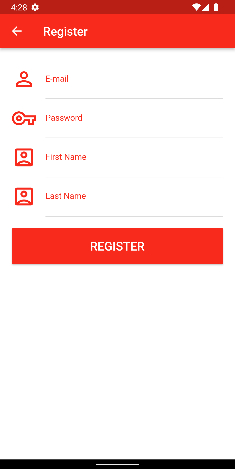          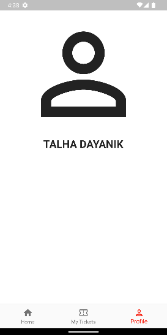

### As member
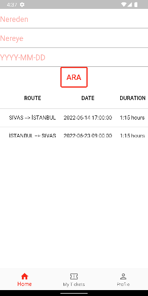When the table is scrolled, price information is also available.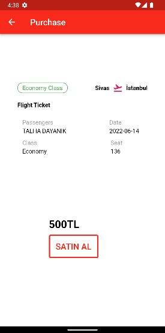          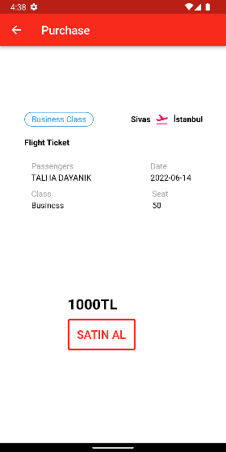          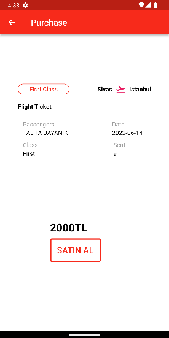          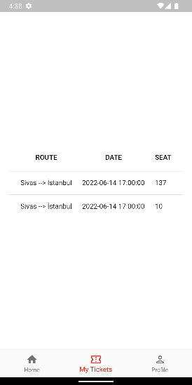

### As admin
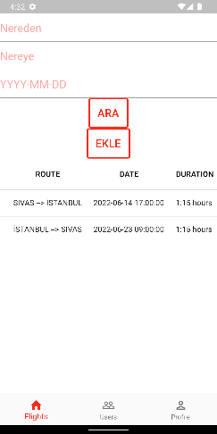          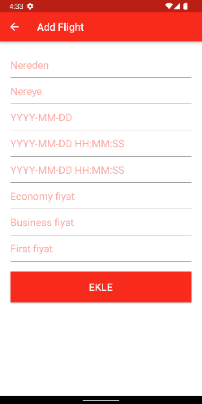          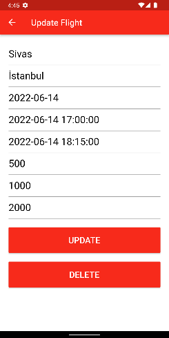          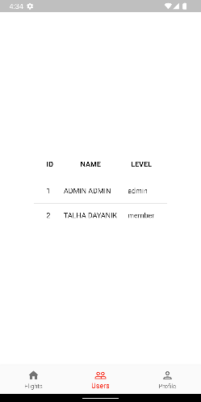
Admin can delete members by clicking on them.

## Database
### Conceptional Design


### Logical Design


### Physical Design
- To create database
```sql
CREATE DATABASE flight_reservation;
```
-To create "users" table
```sql
CREATE TABLE `flight_reservation`.`users` ( `id` INT(11) NOT NULL AUTO_INCREMENT , `email` VARCHAR(30) NOT NULL , `password` VARCHAR(30) NOT NULL , `first_name` VARCHAR(30) NOT NULL , `last_name` VARCHAR(30) NOT NULL , `level` VARCHAR(6) NOT NULL , PRIMARY KEY (`id`)) ENGINE = InnoDB;
```


