# flight-reservation-app-flutter
A flight reservation app with Flutter

## Used Technologies and Libraries
- Flutter
- MySQL
- PHP

## Screens
                    

### As member
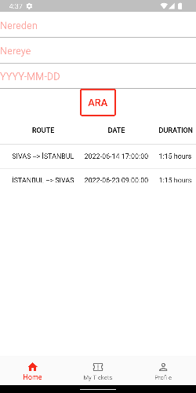When the table is scrolled, price information is also available.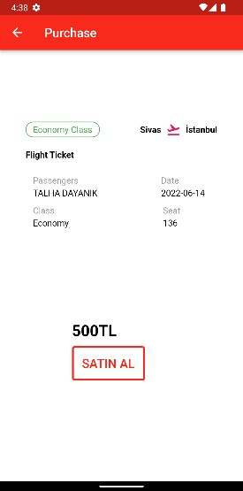          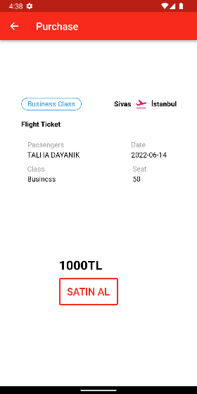          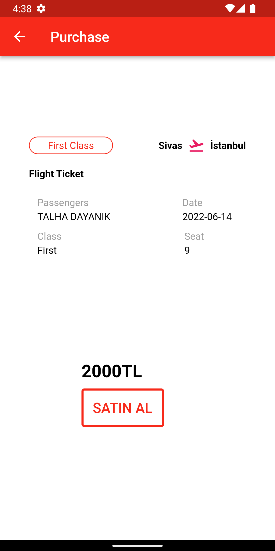          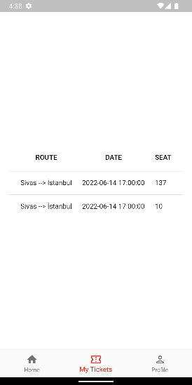

### As admin
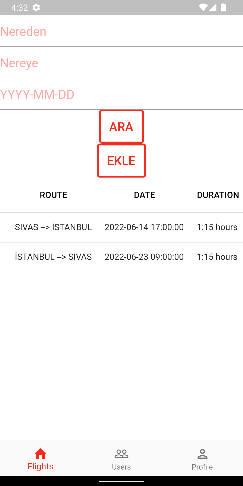          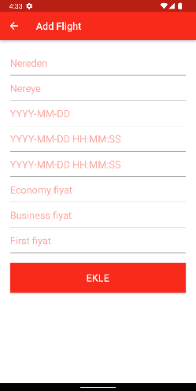          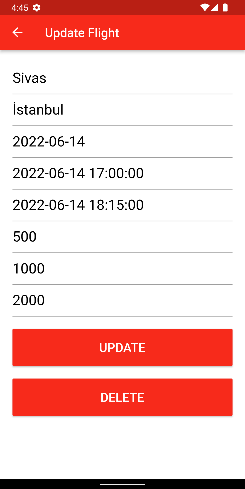          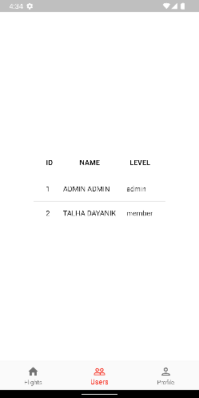
Admin can delete members by clicking on them.

## Database
### Conceptional Design
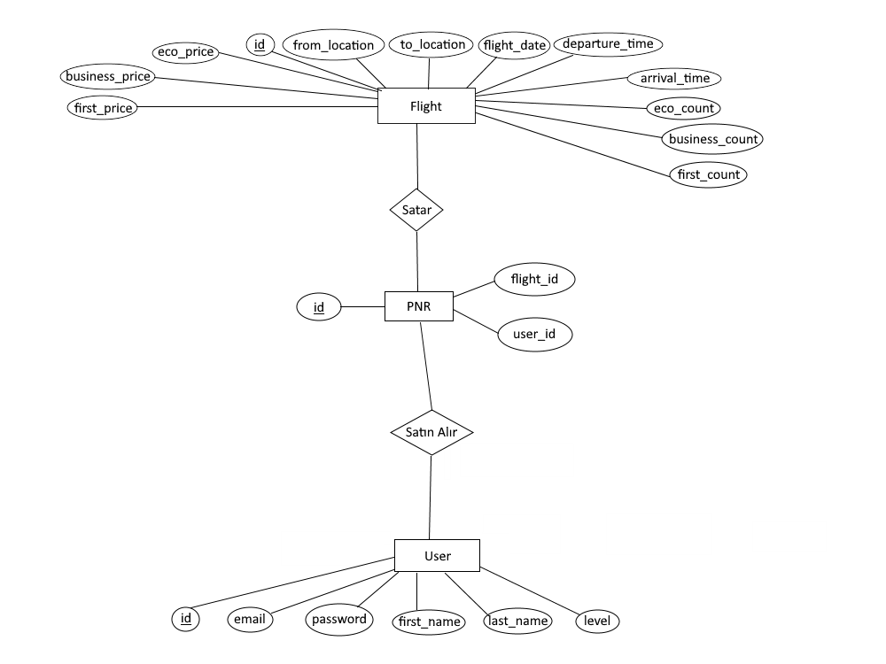

### Logical Design
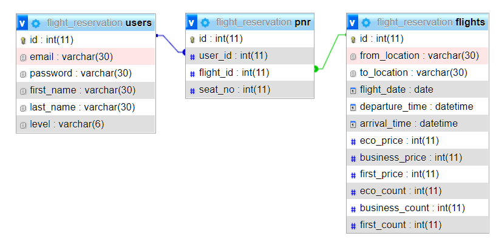

### Physical Design
- To create database
```sql
CREATE DATABASE flight_reservation;
```
- To create "users" table
```sql
CREATE TABLE `flight_reservation`.`users` ( `id` INT(11) NOT NULL AUTO_INCREMENT , `email` VARCHAR(30) NOT NULL , `password` VARCHAR(30) NOT NULL , `first_name` VARCHAR(30) NOT NULL , `last_name` VARCHAR(30) NOT NULL , `level` VARCHAR(6) NOT NULL , PRIMARY KEY (`id`)) ENGINE = InnoDB;
```
- To create "flights" table
```sql
CREATE TABLE `flight_reservation`.`flights` ( `id` INT(11) NOT NULL AUTO_INCREMENT , `from_location` VARCHAR(30) NOT NULL , `to_location` VARCHAR(30) NOT NULL , `flight_date` DATE NOT NULL , `departure_time` DATETIME NOT NULL , `arrival_time` DATETIME NOT NULL , `eco_price` INT(11) NOT NULL , `business_price` INT(11) NOT NULL , `first_price` INT(11) NOT NULL , `eco_count` INT(11) NOT NULL , `business_count` INT(11) NOT NULL , `first_count` INT(11) NOT NULL , PRIMARY KEY (`id`)) ENGINE = InnoDB;
```
- To create "pnr" table
```sql
CREATE TABLE `flight reservation`.`pnr`(`id` INT(11) NOT NULL AUTO_INCREMENT, `user_id` INT(11) FOREIGN KEY REFERENCES users(id), `flight_id` FOREIGN KEY REFERENCES flights(id), `seat_no` INT(11) NOT NULL, PRIMARY KEY(`id`)) ENGINE = InnoDB;
```

